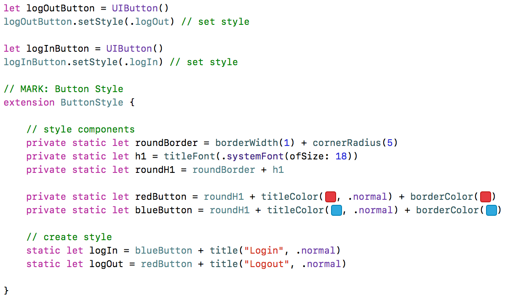

<p align="center"></a>

**EasyStyle** is a Swift framework that lets you create UI styles programmatically inspired by
[Composable, type-safe UIView styling with Swift functions]( https://medium.cobeisfresh.com/composable-type-safe-uiview-styling-with-swift-functions-8be417da947f)

### Easy to use
The example below is quite simple but shows how compose styles

<p align="center"></a>

### Features
* Lightweight and easy to use
* Styles composition
* Autocomplete support
* Short and readable code

### Cocoapods
EasyStyle is available through [CocoaPods](http://cocoapods.org). To install
it, simply add the following line to your `Podfile`:

```ruby
pod "EasyStyle"
```

And [Carthage](https://github.com/Carthage/Carthage) users can simply add Mantle to their `Cartfile`:

```ruby
github "0ber/EasyStyle"

```

### Usage

At first crate a style for UILabel

```swift
// MARK: Label Style
  extension LabelStyle {

    // style components
    private static let h1 = font(.systemFont(ofSize: 28))
    private static let title = h1 + textColor(.red)) + aligment(.center)

    // create style
    static let easyStyle = LabelStyle.create <<< title + text("Easy Style")
  }
```

when just set style to label

```swift
  let titleLabel = UILabel()
  titleLabel.setStyle(.easyStyle) // set style
```

## Author

Alex Kalinkin - [@KalinkinAleksey](https://twitter.com/KalinkinAleksey)

## License

EasyStyle is available under the MIT license. See the LICENSE file for more info.
